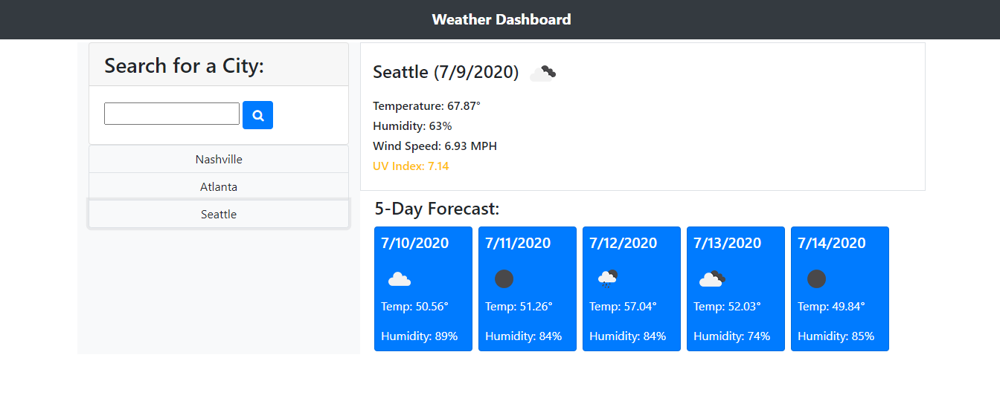

# mod6challenge
A Server-Side API Weather Dashboard

## Description: 
This is a web application where users can enter a city name into the form, and get back current weather information for that city, as well as a 5-day forecast for the city. After a user searches for a city, then their search is stored below the search bar for easy access to search that same city again.

## Screenshot of Webpage

## About the Project:
This project mainly uses the openWeatherMap API to get current and future weather information. The page is styled with Bootstrap.

When a user clicks the search button, it sends the name to three separate functions: one to get the current weather info, a second to get the 5-day forecast, and a third that creates the previous search button. Elements are dynamically created using JavaScript to display the information.

The getWeatherData() function fetches the current weather information from the openWeatherMap API. It then sends the data to a function that displays the temperature, humidity, and windspeed. A second API fetch is made to get the current UV index. 

The get5Day() function fetches the five day forecast information and sends it to the display5Day() function, which creates the cards using the sent information. Because the fetched data has information about the 5-day forecast in 3 hour increments, an array is used to store only the relevant pieces of information that is needed. The forecast for each day is what the weather is like at noon for each day.

The previousSearchBtn() function dynamically creates a button with the name of the previous search below the search bar. Clicking on the button then runs the getWeatherData() and get5Day() functions.

Finally, the savePrevSearches() function and loadPrevSearches() function save the list of buttons to local storage and loads the list when the page is loaded, respectively.

## Link to Deployed Application
https://adamkeyser45.github.io/mod6challenge/